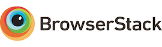

# Bootstrap Italia

[](https://github.com/italia/bootstrap-italia/releases)
[](https://github.com/italia/bootstrap-italia/actions)
[](https://github.com/italia/bootstrap-italia/issues)
[](https://developersitalia.slack.com/messages/C7VPAUVB3/)
[](https://slack.developers.italia.it/)

_🇮🇹 [Versione in italiano](README.md)_

_📦 [Go to Bootstrap Italia 1.x version (based on Bootstrap 4)](https://github.com/italia/bootstrap-italia/tree/1.x)_

New Bootstrap Italia version is a [Bootstrap 5](https://getbootstrap.com/docs/5.1/getting-started/introduction/) theme to create responsive web apps to make Italian public digital services consistent, accessible and simple to use.

Bootstrap Italia inherits components, mixins, grid system, and anything else from Bootstrap 5, customising them accordingly to the [Italian guidelines for designing public digital services](https://docs.italia.it/italia/designers-italia/design-linee-guida-docs/).

The project roadmap is available in the [new Designers Italia 2022 activity plan](https://designers.italia.it/piano-attivita/).

**[Check out the documentation »](https://italia.github.io/bootstrap-italia/)** (in italian)

or

**[Download the latest version of the library »](https://github.com/italia/bootstrap-italia/releases)**

## Index

- [Issues and requests](#issues-and-requests)
- [How to contribute](#how-to-contribute)
- [Third-party licenses](#third-party-licenses)

## Issues and requests

Found a bug or asking for help?

First of all, please ensure you're trying to tackle a problem with the Bootstrap Italia theme and not with the Bootstrap library itself (in that case you can refer directly to [Bootstrap repository](https://github.com/twbs/bootstrap)), then
you can [create an issue](https://github.com/italia/bootstrap-italia/issues).

## How to contribute

Would you like to help with Bootstrap Italia? **You are in the right place!**

If you have not already done so, start by spending a few minutes to deepen your knowledge on [design guidelines for Italian public digital services](https://docs.italia.it/italia/designers-italia/design-linee-guida-docs/) (in italian), and refer to the [instructions on how to contribute to Bootstrap Italia](https://github.com/italia/bootstrap-italia/blob/main/CONTRIBUTING.md) (in italian).

At this point, you'll need to configure the local environment to compile the source files and generate them
of the documentation. You can use [Docker](https://docs.docker.com/get-started/) to start your development environment

```sh
docker-compose up
```

## Third-party licenses

### Components distributed by Bootstrap Italia

Software components distributed with Bootstrap Italia that have their own different license from CC0 are listed below.

- [Bootstrap 5](https://getbootstrap.com) © Twitter, Inc., MIT license
- [Popper.js](https://popper.js.org) © Floating UI contributors, MIT license
- [SplideJS](https://splidejs.com) © Naotoshi Fujita, MIT license
- [Accessible Autocomplete](https://alphagov.github.io/accessible-autocomplete) © Crown Copyright (Government Digital Service), MIT license
- [AnimeJS](https://animejs.com) © Julian Garnier, MIT license
- [Just Validate](https://just-validate.dev) © Horprogs, MIT license
- [Masonry Layout](https://masonry.desandro.com) © David DeSandro, MIT license
- [Progressbar.js](https://kimmobrunfeldt.github.io/progressbar.js) © Kimmo Brunfeldt, MIT license

### Main dependencies for the compilation and development phase

- [Jekyll](https://jekyllrb.com), © Tom Preston-Werner and Jekyll contributors, MIT license
- [HTML-proofer](https://github.com/gjtorikian/html-proofer), © Garen Torikian, MIT license
- [Browser Sync](https://www.browsersync.io/) Apache License Version 2.0
- [conventional-changelog](https://github.com/conventional-changelog/conventional-changelog/) © conventional-changelog team, ISC License
- [Rollup.js](https://rollupjs.org/), © [these contributors](https://github.com/rollup/rollup/graphs/contributors), MIT license
- [Prettier](https://prettier.io/), © James Long and contributorsv
- [sass](https://github.com/sass/dart-sass), © Google Inc., MIT license
- [Octokit rest.js](https://octokit.github.io/rest.js/) © 2012 Cloud9 IDE, Inc. (Mike de Boer), 2017-2018 Octokit contributors, MIT license

### Main dependencies for the documentation

The components used for the documentation site but not redistributed with the Bootstrap Italia library are listed below:

- [tsParticles](https://particles.js.org/) © Matteo Bruni, MIT license
- [clipboard.js](https://clipboardjs.com/) © Zeno Rocha, MIT license
- [AnchorJS](https://www.bryanbraun.com/anchorjs/) © Bryan Braun, MIT license
- [Algolia DocSearch](https://docsearch.algolia.com/) © Algolia, MIT license

## License

Bootstrap Italia is **BSD 3-Clause** licensed:

[](https://github.com/italia/bootstrap-italia/blob/main/LICENSE)

<a href="https://www.browserstack.com/" target="_blank"></a>

We are using BrowserStack for interactive cross browser testing. They are sponsoring our open source project!
